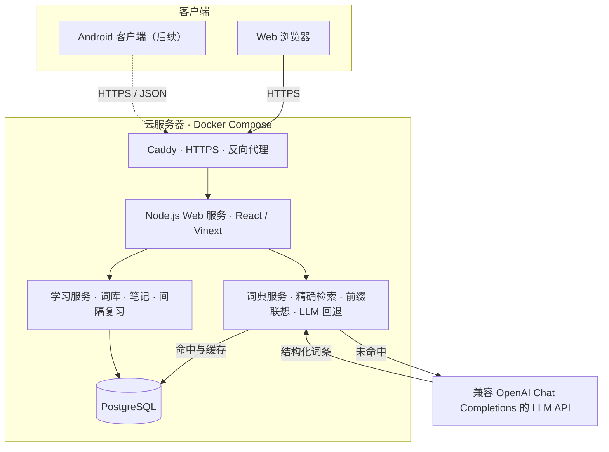

# 鸭嘴兽单词（Platypus Words）

鸭嘴兽单词是面向 Web 与后续 Android 客户端的个人单词本。当前 Web 版支持单词检索、LLM 补全与缓存、近反义词对比、个人笔记、分组收藏、间隔复习、三类练习题和卡片学习。

## 架构



公共词典与个人收藏相互独立。搜索未命中的词会由 LLM 生成、校验并写入 `dictionary_entries`；即使用户没有收藏，下次搜索也直接读取 PostgreSQL 缓存。

## 技术栈

- Node.js `>= 22.13.0`
- React 19、TypeScript、Vinext、Vite
- PostgreSQL 17、Drizzle ORM / Drizzle Kit、`pg`
- Docker Compose、Caddy

## 本地开发

1. 准备 PostgreSQL，并创建数据库 `platypus_words`。
2. 在项目根目录创建 `.env`：

```dotenv
DATABASE_URL=postgresql://postgres:<password>@127.0.0.1:5432/platypus_words
DATABASE_POOL_MAX=10
DATABASE_SSL=disable

API_KEY=<llm-api-key>
BASE_URL=https://<llm-provider>/v1
MODEL_NAME=<model-name>
```

兼容旧配置名 `API-KEY`。所有密钥仅在服务端读取，禁止提交 `.env`。

3. 安装依赖、执行迁移并启动：

```bash
npm install
npm run db:migrate
npm run dev
```

访问 `http://localhost:3000`。首次读取应用状态时会初始化演示词典、默认词库和体验数据。

常用命令：

```bash
npm run lint
npm test
npm run build
npm run db:generate
npm run db:migrate
```

修改 `db/schema.ts` 后先运行 `npm run db:generate`，检查 `drizzle/` 中的增量 SQL，再提交迁移。

## 数据模型

- `dictionary_entries`：公共词条和 LLM 缓存。
- `word_relations`：近反义关系、细微差异和使用场景。
- `word_groups`：用户词库；同一用户只允许一个默认词库。
- `user_words`：用户笔记及跨词库共享的复习进度。
- `group_words`：单词与词库的多对多关系。
- `review_sessions`、`review_tasks`、`review_events`：可恢复的复习会话、题目和答题历史。

搜索联想使用 PostgreSQL B-tree `text_pattern_ops` 前缀索引。相较进程内字典树，该方案无需在每个 Web 实例复制词典，新增 LLM 缓存也能立即被所有实例检索。

## 云服务器部署

推荐 Ubuntu 22.04/24.04、2 核 CPU、2 GB 内存。域名需提前解析到服务器，安全组仅开放 `22`、`80` 和 `443`；PostgreSQL `5432` 不映射到公网。

### 首次部署

安装 Docker Engine 与 Compose 插件后执行：

```bash
sudo mkdir -p /opt/platypus-words
sudo chown "$USER":"$USER" /opt/platypus-words
git clone https://github.com/AnthonyayaPZ/Platypus.git /opt/platypus-words
cd /opt/platypus-words
cp .env.production.example .env.production
chmod 600 .env.production
```

编辑 `.env.production`：

- 将 `APP_DOMAIN` 改为正式域名。
- 用 `openssl rand -hex 24` 生成数据库密码，并同时更新 `POSTGRES_PASSWORD` 与 `DATABASE_URL`。
- 填写 LLM 的 `API_KEY`、`BASE_URL` 和 `MODEL_NAME`。
- 数据库位于同一 Compose 内网时保持 `DATABASE_SSL=disable`；连接托管 PostgreSQL 时按供应商要求设为 `require`。

启动服务：

```bash
docker compose --env-file .env.production up -d --build
docker compose --env-file .env.production ps
```

`migrate` 服务会在应用启动前自动执行 Drizzle 迁移；Caddy 会在域名解析和端口可达后自动申请 HTTPS 证书。

验证：

```bash
curl -I "https://$(sed -n 's/^APP_DOMAIN=//p' .env.production)"
docker compose --env-file .env.production logs --tail=200 app postgres caddy migrate
```

### 更新

先备份，再拉取代码并重建：

```bash
mkdir -p backups
docker compose --env-file .env.production exec -T postgres \
  sh -c 'pg_dump -U "$POSTGRES_USER" -d "$POSTGRES_DB" -Fc' \
  > "backups/platypus_$(date +%F_%H%M%S).dump"

git pull --ff-only
docker compose --env-file .env.production up -d --build
```

建议至少保留 7 天备份，并定期在独立数据库中验证恢复流程。

## API

### 检索与联想

```http
GET /api/search?q=resilient
GET /api/search?suggest=res
```

精确检索优先读取 PostgreSQL；未命中时调用 LLM 并缓存。联想仅查询已缓存词典，不调用 LLM。

### 状态与学习操作

```http
GET /api/state
POST /api/state
Content-Type: application/json
```

`POST /api/state` 支持：

- `createGroup`、`deleteGroup`、`setDefaultGroup`
- `saveWord`、`removeWord`、`updateNote`
- `beginReview`、`answerTask`、`cancelReview`

删除词库至少保留一个；删除默认词库时，系统自动将最早创建的剩余词库设为默认。`removeWord` 仅移除指定词库中的收藏关系。

## 当前边界

- 当前使用本地体验账号，尚未接入注册登录和正式多用户隔离。
- LLM 生成内容上线前仍需增加内容安全策略与质量抽检。
- 发音使用浏览器 Speech Synthesis API。
- Android 客户端尚未开发。
