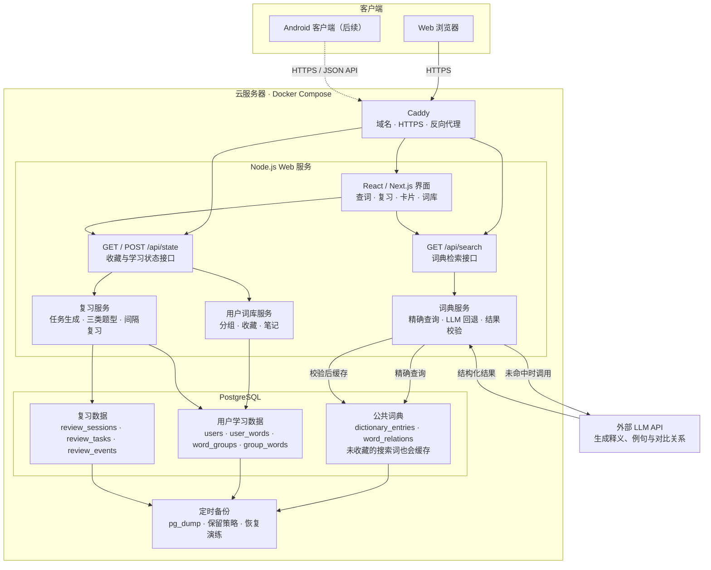

# 鸭嘴兽单词（Platypus Words）

鸭嘴兽单词是一个面向 Web 与后续 Android 客户端的个人单词本 Demo。当前版本包含单词检索、可展开的近反义词详细对比、个人笔记、分组收藏、基于间隔复习的每日任务、三类练习题、词库详情和键盘控制的卡片学习。

当前项目是本地可运行的全栈 Web Demo。单词检索会优先读取服务端词典，未收录的单词由兼容 OpenAI Chat Completions 协议的 LLM 生成并缓存；收藏分组与学习进度存储在 Cloudflare D1 的本地开发实例中。

## 项目架构

下图展示迁移到自建云服务器与 PostgreSQL 后的目标架构。当前版本的 D1 仅位于数据访问层，迁移不会改变客户端、API 或学习业务流程。



核心数据边界：公共词典缓存与用户收藏相互独立；搜索生成的词条会写入公共词典，只有用户点击收藏后才会进入个人学习与复习数据。

## 项目路径

```text
/Users/lipeizhang/Downloads/code/vibe/Platypus Words
```

## 技术栈

- React 19 + TypeScript
- Next.js API 约定与 Vinext
- Vite
- Cloudflare Workers
- Cloudflare D1
- Drizzle ORM / Drizzle Kit
- Tailwind CSS 4（通过全局样式入口加载）

## 环境要求

- Node.js `>= 22.13.0`
- npm

检查版本：

```bash
node --version
npm --version
```

如果系统默认 Node.js 版本较低，请先通过 nvm、fnm 或其他版本管理工具切换到 Node.js 22。

## 本地启动

进入项目目录：

```bash
cd "/Users/lipeizhang/Downloads/code/vibe/Platypus Words"
```

首次运行时安装依赖：

```bash
npm install
```

启动开发服务：

```bash
npm run dev
```

浏览器打开：

```text
http://localhost:3000
```

开发服务支持热更新。停止服务时，在运行服务的终端按 `Ctrl + C`。

### LLM 配置

新词生成读取项目根目录 `.env` 中的服务端配置：

```dotenv
API-KEY=服务密钥
BASE_URL=https://服务地址/v1
MODEL_NAME=模型名称
```

也支持将 `API-KEY` 写成更常见的 `API_KEY`。密钥只在服务端请求上游接口，不会返回到浏览器；`.env` 已被 Git 忽略，不应提交到仓库。

## 生产构建与本地预览

生成生产版本：

```bash
npm run build
```

构建成功后，产物位于 `dist/`。使用生产模式在本地启动：

```bash
npm run start
```

然后访问 `http://localhost:3000`。

## 数据库

项目通过 `.openai/hosting.json` 声明名为 `DB` 的 D1 数据库绑定：

```json
{
  "d1": "DB",
  "r2": null
}
```

本地开发时，数据库由 Wrangler/Miniflare 自动模拟。首次访问 `/api/state` 时会自动创建表，并初始化三个分组以及默认收藏组中的 20 个示例词。旧版 `saved_words` 数据会自动迁移到新的个人单词、分组关系和全局复习状态中。

数据库结构位于：

```text
db/schema.ts
```

主要数据按职责拆分为：公共词典 `dictionary_entries`、近反义词差异与使用场景 `word_relations`、个人笔记与复习状态 `user_words`、分组关系 `group_words`，以及可恢复的 `review_sessions`、`review_tasks` 和答题历史 `review_events`。

修改数据库结构后生成迁移：

```bash
npm run db:generate
```

生成的 SQL 位于 `drizzle/`。提交或部署前应检查迁移内容，并将迁移文件一并保留。

如需清空本地体验数据，可在服务停止后删除项目内的 `.wrangler/` 目录；下次启动并访问应用时会重新初始化。这个操作不会影响已部署的线上数据库。

## 自建云服务器部署（PostgreSQL）

推荐使用 Docker Compose 在同一台 Linux 云服务器上运行 Web、PostgreSQL 和 Caddy：

```text
Internet → Caddy（HTTPS）→ Web:3000 → PostgreSQL:5432
```

> 当前代码仍使用 Cloudflare D1。执行本节前，必须先完成 PostgreSQL 适配；否则 Web 服务无法连接 PostgreSQL。数据库只允许容器内网访问，不要向公网开放 `5432`。

### 1. PostgreSQL 适配

部署前完成并测试以下改造：

1. 将 `db/schema.ts` 从 `sqlite-core` 改为 `pg-core`。
2. 使用 `pg` 与 `drizzle-orm/node-postgres` 替换 D1 访问层。
3. 移除 D1 绑定及 `cloudflare:workers` 环境变量访问，Node.js 运行时统一读取 `process.env`。
4. 将 Drizzle 配置的 `dialect` 改为 `postgresql`，连接地址读取 `DATABASE_URL`。
5. 增加 `db:migrate` 命令，并生成 PostgreSQL 初始迁移。
6. 保留 `dictionary_entries`、`word_relations`、用户收藏和复习记录等现有表结构与约束。
7. 确认 `npm run build`、数据库迁移和全部接口测试通过。

生产环境应使用标准 Node.js 服务启动；当前 `npm run start` 默认监听 `0.0.0.0:3000`。

### 2. 服务器准备

建议配置为 Ubuntu 22.04/24.04、2 核 CPU、2 GB 内存和 20 GB 系统盘。提前完成：

- 将域名的 `A`/`AAAA` 记录指向服务器。
- 在云防火墙中仅开放 `22`、`80` 和 `443`。
- 按 [Docker 官方文档](https://docs.docker.com/engine/install/ubuntu/)安装 Docker Engine 与 Compose 插件。

验证环境：

```bash
docker --version
docker compose version
```

### 3. 生产配置

在项目根目录创建 `.env.production`，权限设置为 `600`。密码建议使用 `openssl rand -hex 24` 生成，并在 `POSTGRES_PASSWORD` 与 `DATABASE_URL` 中填写同一个值。

```dotenv
NODE_ENV=production
POSTGRES_DB=platypus_words
POSTGRES_USER=platypus
POSTGRES_PASSWORD=<strong-hex-password>
DATABASE_URL=postgresql://platypus:<strong-hex-password>@postgres:5432/platypus_words

API_KEY=<llm-api-key>
BASE_URL=https://<llm-provider>/v1
MODEL_NAME=<model-name>
```

不要提交 `.env.production`。在 `.dockerignore` 中排除本地与敏感文件：

```text
.git
.env*
node_modules
dist
.next
.vinext
.wrangler
```

### 4. 容器配置

在项目根目录创建 `Dockerfile`：

```dockerfile
FROM node:22-alpine AS build
WORKDIR /app
COPY package*.json ./
RUN npm ci
COPY . .
RUN npm run build

FROM node:22-alpine AS runtime
WORKDIR /app
ENV NODE_ENV=production PORT=3000
COPY --from=build --chown=node:node /app /app
USER node
EXPOSE 3000
CMD ["npm", "run", "start"]
```

创建 `compose.yaml`：

```yaml
name: platypus-words

services:
  postgres:
    image: postgres:17-alpine
    restart: unless-stopped
    env_file: .env.production
    volumes:
      - postgres_data:/var/lib/postgresql/data
    healthcheck:
      test: ["CMD-SHELL", "pg_isready -U $$POSTGRES_USER -d $$POSTGRES_DB"]
      interval: 10s
      timeout: 5s
      retries: 5

  app:
    build: .
    restart: unless-stopped
    env_file: .env.production
    depends_on:
      postgres:
        condition: service_healthy
    expose:
      - "3000"

  caddy:
    image: caddy:2-alpine
    restart: unless-stopped
    depends_on:
      - app
    ports:
      - "80:80"
      - "443:443"
      - "443:443/udp"
    volumes:
      - ./Caddyfile:/etc/caddy/Caddyfile:ro
      - caddy_data:/data
      - caddy_config:/config

volumes:
  postgres_data:
  caddy_data:
  caddy_config:
```

创建 `Caddyfile`，将域名替换为正式域名。域名解析正确且 `80/443` 可访问时，Caddy 会自动申请并续期 HTTPS 证书。

```caddyfile
words.example.com {
  encode zstd gzip
  reverse_proxy app:3000

  header {
    Strict-Transport-Security "max-age=31536000; includeSubDomains"
    X-Content-Type-Options "nosniff"
    Referrer-Policy "strict-origin-when-cross-origin"
  }
}
```

### 5. 首次部署

```bash
sudo mkdir -p /opt/platypus-words
sudo chown "$USER":"$USER" /opt/platypus-words
git clone https://github.com/AnthonyayaPZ/Platypus.git /opt/platypus-words
cd /opt/platypus-words
# 按第 3 节创建并填写 .env.production
chmod 600 .env.production
docker compose --env-file .env.production build app
docker compose --env-file .env.production up -d postgres
docker compose --env-file .env.production run --rm app npm run db:migrate
docker compose --env-file .env.production up -d
docker compose --env-file .env.production ps
```

验证站点与接口：

```bash
curl -I https://words.example.com
curl https://words.example.com/api/state
```

查看故障日志：

```bash
docker compose --env-file .env.production logs --tail=200 app postgres caddy
```

### 6. 更新与备份

发布新版本前先备份数据库，再执行迁移和滚动更新：

```bash
mkdir -p backups
docker compose --env-file .env.production exec -T postgres \
  sh -c 'pg_dump -U "$POSTGRES_USER" -d "$POSTGRES_DB" -Fc' \
  > "backups/platypus_$(date +%F_%H%M%S).dump"

git pull --ff-only
docker compose --env-file .env.production build app
docker compose --env-file .env.production run --rm app npm run db:migrate
docker compose --env-file .env.production up -d --no-deps app
```

至少保留 7 天自动备份，并定期验证备份可恢复。应用回滚可切回上一 Git 标签后重新构建；数据库迁移应保持向前兼容，涉及破坏性变更时必须先验证恢复流程。

## 可选：部署到 OpenAI Sites

项目已采用 Sites 所需的 Vinext 与 Cloudflare Workers 结构，并在 `.openai/hosting.json` 中声明 D1 绑定。

部署前先执行：

```bash
npm install
npm run db:generate
npm run build
```

确认构建成功且 `drizzle/` 中包含最新迁移后，在 Codex 中对当前项目发出部署请求，例如：

```text
请将当前鸭嘴兽单词项目部署到 OpenAI Sites，使用私有部署。
```

首次部署时，Sites 会创建站点、远程源码仓库和 D1 数据库，并把站点标识写回 `.openai/hosting.json`。后续部署应复用同一个站点，不要删除其中的 `project_id`。

Sites 部署流程会：

1. 使用当前已验证的源码和 `dist/` 构建产物。
2. 打包 `.openai/hosting.json` 与 `drizzle/` 数据库迁移。
3. 保存新的站点版本。
4. 优先发布为私有站点。
5. 等待部署完成并返回可访问地址。

当前尚未执行线上部署，因此 `.openai/hosting.json` 中还没有 `project_id`。

## 关键目录

```text
app/page.tsx              主页面与交互逻辑
app/globals.css           响应式视觉样式
app/api/search/route.ts   单词检索接口
app/api/state/route.ts    分组、收藏与复习进度接口
lib/dictionary.ts         Demo 示例词库
lib/llm.ts                LLM 新词生成与响应校验
db/schema.ts              D1 数据库结构
drizzle/                  数据库迁移
public/og.png             社交分享预览图
.openai/hosting.json      Sites 与存储绑定配置
```

## 接口说明

### 单词检索

```http
GET /api/search?q=resilient
```

检索会先精确查询服务端 D1 词典。未命中时，服务端调用 `.env` 配置的 LLM，校验返回的释义、例句、两个近义词和两个反义词后写入 D1；再次检索同一单词时直接使用缓存结果。

### 应用状态

```http
GET /api/state
```

返回分组、收藏单词和复习进度。

```http
POST /api/state
Content-Type: application/json
```

支持的操作：

- `createGroup`：创建单词分组。
- `saveWord`：收藏单词到指定分组。
- `updateNote`：保存用户针对单词的个人笔记。
- `beginReview`：根据复习计划创建或恢复一组最多 10 个单词的复习会话；每个单词首次出现时先进行听音选词。
- `answerTask`：保存单题结果；一个单词的三种题型完成后更新下次复习日期。
- `cancelReview`：结束未完成的复习会话而不修改单词进度。

## 当前 Demo 边界

- LLM 当前用于生成 Demo 词典未收录的新词；生成质量仍需在正式上线前增加人工抽检与内容安全策略。
- 使用本地体验账号，尚未实现多用户登录与数据隔离。
- 发音使用浏览器的 Speech Synthesis API，不是服务器音频文件。
- 尚未开发 Android 客户端。
- 尚未执行线上部署。

建议在 Web Demo 验收后，再依次完善正式词典数据源、用户体系、线上 D1 数据库与 Android 客户端。
